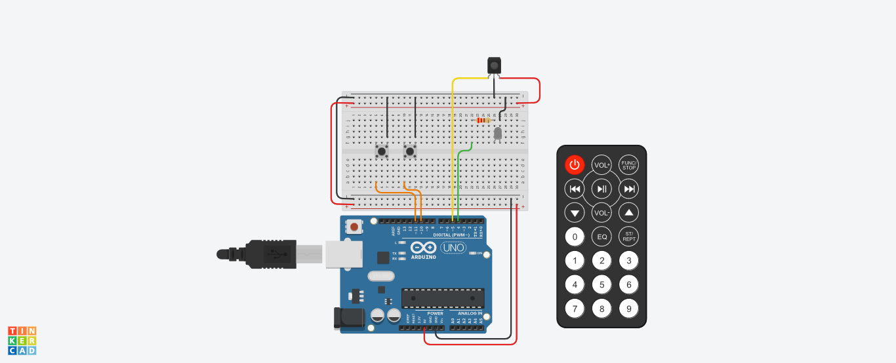

# IR-Repeat-O-Matic: The Ultimate Remote Control Copier!
Have you ever found yourself frustrated by a lost remote control or the need to juggle multiple remotes for your devices? Introducing the **IR-Repeat-O-Matic**, a fun and innovative project that allows you to copy and mimic the signals from any infrared remote control with just the press of a button!

### Overview
The IR-Repeat-O-Matic is a clever little device built using an ESP32 microcontroller, an IR receiver, and an IR transmitter. This project enables users to capture the signals from their existing remote controls and store them in the memory of the ESP32. With two simple buttons on the board, you can easily send these stored signals to your devices, such as TVs, air conditioners, or any other IR-controlled appliance.
### How It Works
1. **Capture Mode**:
    - When you hold down one of the two buttons on the IR-Repeat-O-Matic and press a key on your remote control, the IR receiver captures the signal from that remote. The captured signal is then stored in the ESP32's memory for later use.
2. **Playback Mode**:
    - Once you've captured the desired signals, simply press the corresponding button on your board to transmit the stored signal using the IR transmitter. This mimics the behavior of your original remote control, allowing you to control your devices effortlessly.

### Features
- **User-Friendly Interface**: With just two buttons, capturing and transmitting signals is as easy as 1-2-3!
- **Memory Storage**: The ESP32 can store multiple signals, so you can copy various remotes without any hassle.
- **Versatile Compatibility**: Works with most infrared remote-controlled devices, making it a universal solution for your remote control needs.
- **Compact Design**: Built on a small footprint, making it easy to integrate into any home automation project.

### Libraries Used
This project utilizes:
- **IRremote**: A powerful library that enables sending and receiving infrared signals with multiple protocols. It simplifies capturing and transmitting IR data.
- **EEPROM Library**: The EEPROM library allows for persistent storage of captured IR signals in flash memory on the ESP32. This ensures that even after a reboot, your stored data remains intact.

### Compatibility Note
Currently, I have tested the IR-Repeat-O-Matic specifically with Xvision series TVs. If you wish to use it with other remote controls or devices, please note that adjustments to the code may be necessary, and further testing will be required to ensure compatibility.

#### Why Use IR-Repeat-O-Matic?
The IR-Repeat-O-Matic is perfect for anyone looking to simplify their remote control experience. Whether you're tired of searching for lost remotes or want a single device to control all your appliances, this project has got you covered. It's not only practical but also a fun way to explore infrared communication and microcontroller programming!
### Get Started!
Ready to take control? Check out the code and detailed instructions in my GitHub repository here. Join me in making remote controls fun again with the IR-Repeat-O-Matic! Feel free to adjust any part of this description or title to better fit your vision for your project!
